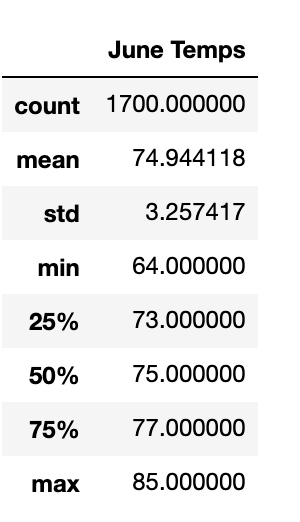

# Surfs Up

## Overview Analysis

The purpose of this analysis is to determine the best times to have the surf and shake shop open and expectations based on temperatures in June and December in Oahu. 

## Results

 

* The temperatures from June and December are fairly similar. One can see this by looking at the mean averages for both months with having only a difference of around 3 degrees. 
* A big differantiator from the information in the tables is the lowest temperature. That would be for December hitting 56 degrees compared to 64 degrees in June. This looks like a one off as the mean adjusts to similar temperatures as June. 
* Max temperatures hit almost the same different from the minimum. The trend of temperatures being so close to each other is Hawaii itself having a tropical climate. Usually there are no harsh differences in temperatures per seasons.

## Summary 
There seems to be small amounts of differences from June to December in regards to temperature affecting the shop. Two other queries that can be examined to further analyze any effect would be to measure the amount of rain per month. Since Hawaii is tropical, there is usually high amounts of rain forecast. Another query that can be used, is the amount of sun per day recieved given that overcast can also affect the shop. 
